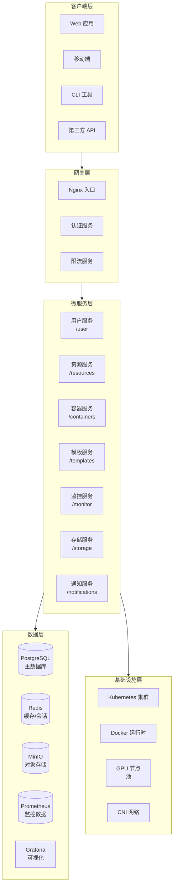
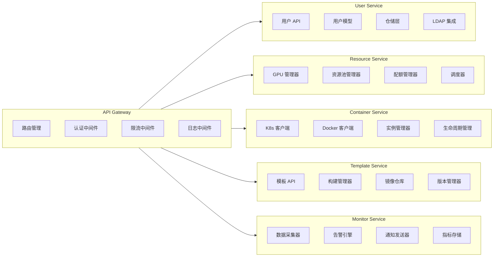
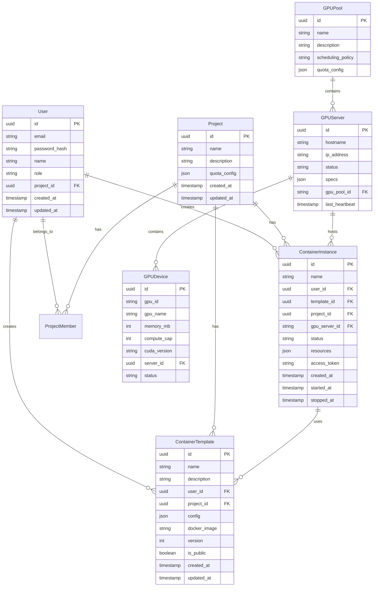
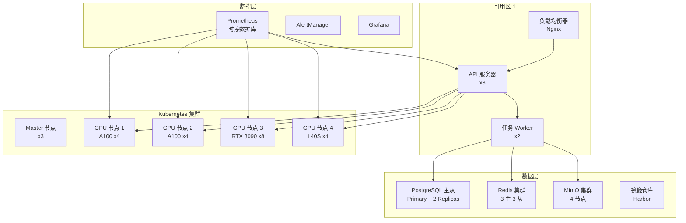

# GPU 容器化服务管理平台技术设计文档

**特性名称：** gpu-container-platform
**更新日期：** 2026-02-05

## 项目概述

本技术设计文档详细描述了 GPU 容器化服务管理平台的架构设计、组件接口、数据模型和实现方案。该平台基于微服务架构设计，支持 Docker 和 Kubernetes 容器技术，提供完整的 GPU 资源管理、容器实例生命周期管理、用户认证和资源配额等功能。

## 系统架构

### 整体架构图



### 技术栈选型

| 层次 | 技术选型 | 选型理由 |
|------|---------|---------|
| 前端框架 | React 18 + TypeScript | 成熟的生态系统，良好的类型安全 |
| UI 组件库 | Ant Design 5 | 企业级 UI 组件，丰富的主题定制 |
| 后端框架 | Go 1.21 + Gin | 高性能，适合容器化部署 |
| 微服务框架 | Go-Micro v4 | 成熟的微服务框架，支持服务发现 |
| 容器编排 | Kubernetes 1.28 | 业界标准，功能完善 |
| 容器运行时 | Docker 24 + containerd | 广泛的生态支持 |
| 数据库 | PostgreSQL 15 | 可靠性高，功能强大 |
| 缓存 | Redis 7 | 高性能缓存和会话存储 |
| 对象存储 | MinIO | S3 兼容，私有部署 |
| 消息队列 | NATS | 轻量级，高性能 |
| 监控系统 | Prometheus + Grafana | 成熟的监控解决方案 |
| 日志系统 | ELK Stack | 强大的日志分析能力 |
| CI/CD | GitLab CI | 与代码仓库深度集成 |

## 组件设计

### 组件架构图



### 组件职责说明

| 组件名称 | 职责 | 主要功能 |
|---------|------|---------|
| API Gateway | 请求入口和路由 | 请求路由、认证授权、限流熔断、日志记录 |
| User Service | 用户管理 | 用户注册、登录认证、角色管理、权限控制 |
| Resource Service | GPU 资源管理 | 资源池管理、GPU 调度、配额控制、资源监控 |
| Container Service | 容器生命周期管理 | 容器创建、启动、停止、删除、状态监控 |
| Template Service | 容器模板管理 | 模板 CRUD、镜像构建、版本管理、模板市场 |
| Monitor Service | 系统监控 | 指标采集、告警规则、通知发送、仪表盘 |
| Storage Service | 存储管理 | 个人存储、共享存储、快照管理、文件传输 |
| Notification Service | 通知服务 | 邮件通知、站内通知、告警推送 |

## 数据模型

### 核心实体关系图



### 核心数据结构定义

#### 用户模型 (User)

```go
type User struct {
    ID           uuid.UUID    `json:"id" gorm:"type:uuid;primaryKey"`
    Email        string       `json:"email" gorm:"uniqueIndex;size:255"`
    PasswordHash string       `json:"-" gorm:"size:255"`
    Name         string       `json:"name" gorm:"size:100"`
    Role         string       `json:"role" gorm:"size:20;default:'user'"`
    Status       string       `json:"status" gorm:"size:20;default:'active'"`
    ProjectID    *uuid.UUID   `json:"projectId" gorm:"type:uuid"`
    LastLoginAt  *time.Time   `json:"lastLoginAt"`
    CreatedAt    time.Time    `json:"createdAt"`
    UpdatedAt    time.Time    `json:"updatedAt"`
}

type UserRole string

const (
    RoleAdmin     UserRole = "admin"
    RoleDeveloper UserRole = "developer"
    RoleGuest     UserRole = "guest"
)

type UserStatus string

const (
    UserStatusActive  UserStatus = "active"
    UserStatusInactive UserStatus = "inactive"
    UserStatusLocked   UserStatus = "locked"
)
```

#### GPU 服务器模型 (GPUServer)

```go
type GPUServer struct {
    ID            uuid.UUID    `json:"id" gorm:"type:uuid;primaryKey"`
    Hostname      string       `json:"hostname" gorm:"size:255;uniqueIndex"`
    IPAddress     string       `json:"ipAddress" gorm:"size:45"`
    Status        ServerStatus `json:"status" gorm:"size:20;default:'offline'"`
    Specs          ServerSpecs  `json:"specs" gorm:"type:jsonb"`
    GPUPoolID     *uuid.UUID   `json:"gpuPoolId" gorm:"type:uuid"`
    LastHeartbeat time.Time    `json:"lastHeartbeat"`
    CreatedAt     time.Time    `json:"createdAt"`
    UpdatedAt     time.Time    `json:"updatedAt"`
}

type ServerSpecs struct {
    CPUCores      int      `json:"cpuCores"`
    MemoryMB      int      `json:"memoryMb"`
    StorageGB     int      `json:"storageGb"`
    OSVersion     string   `json:"osVersion"`
    DockerVersion string   `json:"dockerVersion"`
    NVIDIADriver  string   `json:"nvidiaDriver"`
    GPUDevices    []GPUDevice `json:"gpuDevices"`
}

type GPUDevice struct {
    ID             string `json:"id"`
    Name           string `json:"name"`
    MemoryMB       int    `json:"memoryMb"`
    ComputeCap     int    `json:"computeCap"`
    CudaVersion    string `json:"cudaVersion"`
    Temperature    int    `json:"temperature"`
    PowerUsage     int    `json:"powerUsage"`
}
```

#### 容器实例模型 (ContainerInstance)

```go
type ContainerInstance struct {
    ID           uuid.UUID         `json:"id" gorm:"type:uuid;primaryKey"`
    Name         string            `json:"name" gorm:"size:255"`
    UserID       uuid.UUID         `json:"userId" gorm:"type:uuid;index"`
    ProjectID    *uuid.UUID        `json:"projectId" gorm:"type:uuid;index"`
    TemplateID   *uuid.UUID        `json:"templateId" gorm:"type:uuid"`
    GPUServerID  *uuid.UUID        `json:"gpuServerId" gorm:"type:uuid"`
    Status       InstanceStatus    `json:"status" gorm:"size:20;default:'pending'"`
    Resources    ContainerResources `json:"resources" gorm:"type:jsonb"`
    AccessToken  string            `json:"accessToken" gorm:"size:255"`
    SSHPort      int               `json:"sshPort"`
    WebPort      int               `json:"webPort"`
    ContainerID  string            `json:"containerId" gorm:"size:100"`
    PodName      string            `json:"podName" gorm:"size:255"`
    IPAddress    string            `json:"ipAddress" gorm:"size:45"`
    StartedAt    *time.Time        `json:"startedAt"`
    StoppedAt    *time.Time        `json:"stoppedAt"`
    ExpiresAt    *time.Time        `json:"expiresAt"`
    CreatedAt    time.Time         `json:"createdAt"`
    UpdatedAt    time.Time         `json:"updatedAt"`
}

type ContainerResources struct {
    GPUCount      int    `json:"gpuCount"`
    GPUModel      string  `json:"gpuModel"`
    CPUCores      int    `json:"cpuCores"`
    MemoryMB      int    `json:"memoryMb"`
    StorageGB     int    `json:"storageGb"`
    Image         string `json:"image"`
    Command       string `json:"command"`
    Environment   map[string]string `json:"environment"`
    Ports         []int  `json:"ports"`
    Volumes       []VolumeMount `json:"volumes"`
}

type VolumeMount struct {
    Name      string `json:"name"`
    MountPath string `json:"mountPath"`
    SizeGB    int    `json:"sizeGb"`
}
```

#### 容器模板模型 (ContainerTemplate)

```go
type ContainerTemplate struct {
    ID           uuid.UUID    `json:"id" gorm:"type:uuid;primaryKey"`
    Name         string       `json:"name" gorm:"size:100;index"`
    Description  string       `json:"description" gorm:"size:1000"`
    UserID       uuid.UUID    `json:"userId" gorm:"type:uuid;index"`
    ProjectID    *uuid.UUID   `json:"projectId" gorm:"type:uuid;index"`
    Config       TemplateConfig `json:"config" gorm:"type:jsonb"`
    DockerImage  string       `json:"dockerImage" gorm:"size:500"`
    Dockerfile   string       `json:"dockerfile" gorm:"type:text"`
    Version      int          `json:"version" gorm:"default:1"`
    Status       string       `json:"status" gorm:"size:20;default:'draft'"`
    IsPublic     bool         `json:"isPublic" gorm:"default:false"`
    UsageCount   int          `json:"usageCount" gorm:"default:0"`
    CreatedAt    time.Time    `json:"createdAt"`
    UpdatedAt    time.Time    `json:"updatedAt"`
}

type TemplateConfig struct {
    BaseImage      string            `json:"baseImage"`
    CUDAVersion    string            `json:"cudaVersion"`
    CUDNNVersion   string            `json:"cudnnVersion"`
    PythonVersion  string            `json:"pythonVersion"`
    Packages       []string          `json:"packages"`
    pipPackages    []string          `json:"pipPackages"`
    condaPackages  []string          `json:"condaPackages"`
    Environment    map[string]string `json:"environment"`
    Entrypoint     string            `json:"entrypoint"`
    WorkingDir     string            `json:"workingDir"`
    Labels         map[string]string `json:"labels"`
}
```

## 接口设计

### API 网关路由配置

```yaml
/api/v1:
  # 用户认证
  POST /auth/register:
    handler: UserService.Register
    rateLimit: 10/min
  
  POST /auth/login:
    handler: UserService.Login
    rateLimit: 20/min
  
  POST /auth/logout:
    handler: UserService.Logout
    auth: required
  
  POST /auth/refresh:
    handler: UserService.RefreshToken
    auth: required
  
  # 用户管理
  GET /users/me:
    handler: UserService.GetCurrentUser
    auth: required
  
  PUT /users/me:
    handler: UserService.UpdateCurrentUser
    auth: required
  
  POST /users/me/password:
    handler: UserService.ChangePassword
    auth: required
  
  # GPU 资源管理
  GET /resources/gpu-servers:
    handler: ResourceService.ListGPUServers
    auth: required
  
  GET /resources/gpu-pools:
    handler: ResourceService.ListGPUPools
    auth: required
  
  GET /resources/availability:
    handler: ResourceService.CheckAvailability
    auth: required
  
  # 容器实例管理
  GET /containers:
    handler: ContainerService.ListInstances
    auth: required
  
  POST /containers:
    handler: ContainerService.CreateInstance
    auth: required
    rateLimit: 5/min
  
  GET /containers/{id}:
    handler: ContainerService.GetInstance
    auth: required
  
  DELETE /containers/{id}:
    handler: ContainerService.DeleteInstance
    auth: required
  
  POST /containers/{id}/start:
    handler: ContainerService.StartInstance
    auth: required
  
  POST /containers/{id}/stop:
    handler: ContainerService.StopInstance
    auth: required
  
  POST /containers/{id}/restart:
    handler: ContainerService.RestartInstance
    auth: required
  
  GET /containers/{id}/logs:
    handler: ContainerService.GetInstanceLogs
    auth: required
  
  POST /containers/{id}/exec:
    handler: ContainerService.ExecuteCommand
    auth: required
  
  # 容器模板管理
  GET /templates:
    handler: TemplateService.ListTemplates
    auth: required
  
  POST /templates:
    handler: TemplateService.CreateTemplate
    auth: required
  
  GET /templates/{id}:
    handler: TemplateService.GetTemplate
    auth: required
  
  PUT /templates/{id}:
    handler: TemplateService.UpdateTemplate
    auth: required
  
  DELETE /templates/{id}:
    handler: TemplateService.DeleteTemplate
    auth: required
  
  POST /templates/{id}/build:
    handler: TemplateService.BuildImage
    auth: required
  
  POST /templates/{id}/publish:
    handler: TemplateService.PublishTemplate
    auth: required
  
  # 监控与告警
  GET /monitor/metrics:
    handler: MonitorService.GetMetrics
    auth: required
  
  GET /monitor/alerts:
    handler: MonitorService.GetAlerts
    auth: required
  
  POST /monitor/alerts/{id}/acknowledge:
    handler: MonitorService.AcknowledgeAlert
    auth: required
  
  GET /monitor/dashboard:
    handler: MonitorService.GetDashboard
    auth: required
  
  # 存储管理
  GET /storage/files:
    handler: StorageService.ListFiles
    auth: required
  
  POST /storage/files:
    handler: StorageService.UploadFile
    auth: required
  
  GET /storage/files/{path}:
    handler: StorageService.DownloadFile
    auth: required
  
  DELETE /storage/files/{path}:
    handler: StorageService.DeleteFile
    auth: required
  
  POST /storage/snapshots:
    handler: StorageService.CreateSnapshot
    auth: required
  
  # 项目管理
  GET /projects:
    handler: ProjectService.ListProjects
    auth: required
  
  POST /projects:
    handler: ProjectService.CreateProject
    auth: required
  
  GET /projects/{id}:
    handler: ProjectService.GetProject
    auth: required
  
  PUT /projects/{id}:
    handler: ProjectService.UpdateProject
    auth: required
  
  DELETE /projects/{id}:
    handler: ProjectService.DeleteProject
    auth: required
```

### 认证服务设计

```go
type AuthService interface {
    Register(ctx context.Context, req *RegisterRequest) (*RegisterResponse, error)
    Login(ctx context.Context, req *LoginRequest) (*LoginResponse, error)
    Logout(ctx context.Context, req *LogoutRequest) error
    RefreshToken(ctx context.Context, req *RefreshTokenRequest) (*TokenResponse, error)
    ValidateToken(ctx context.Context, token string) (*Claims, error)
    ChangePassword(ctx context.Context, req *ChangePasswordRequest) error
    ResetPassword(ctx context.Context, req *ResetPasswordRequest) error
}

type RegisterRequest struct {
    Email    string `json:"email" binding:"required,email"`
    Password string `json:"password" binding:"required,min=12"`
    Name     string `json:"name" binding:"required,min=2,max=100"`
}

type LoginRequest struct {
    Email    string `json:"email" binding:"required,email"`
    Password string `json:"password" binding:"required"`
    MFACode  string `json:"mfaCode"`
}

type TokenResponse struct {
    AccessToken  string `json:"accessToken"`
    RefreshToken string `json:"refreshToken"`
    ExpiresIn    int    `json:"expiresIn"`
    TokenType    string `json:"tokenType"`
}
```

### 容器服务设计

```go
type ContainerService interface {
    ListInstances(ctx context.Context, req *ListInstancesRequest) (*ListInstancesResponse, error)
    CreateInstance(ctx context.Context, req *CreateInstanceRequest) (*InstanceResponse, error)
    GetInstance(ctx context.Context, id uuid.UUID) (*InstanceResponse, error)
    DeleteInstance(ctx context.Context, id uuid.UUID) error
    StartInstance(ctx context.Context, id uuid.UUID) error
    StopInstance(ctx context.Context, id uuid.UUID) error
    RestartInstance(ctx context.Context, id uuid.UUID) error
    GetInstanceLogs(ctx context.Context, id uuid.UUID, req *GetLogsRequest) (*LogsResponse, error)
    ExecuteCommand(ctx context.Context, id uuid.UUID, req *ExecRequest) (*ExecResponse, error)
    GetInstanceMetrics(ctx context.Context, id uuid.UUID) (*MetricsResponse, error)
}

type CreateInstanceRequest struct {
    Name       string              `json:"name" binding:"required,min=3,max=63,regexp=^[a-zA-Z0-9-]+$"`
    TemplateID *uuid.UUID          `json:"templateId"`
    ProjectID  *uuid.UUID          `json:"projectId"`
    Resources  ContainerResources  `json:"resources" binding:"required"`
    Volumes    []VolumeRequest     `json:"volumes"`
    Environment map[string]string  `json:"environment"`
    StartCmd   string              `json:"startCmd"`
}

type InstanceResponse struct {
    ID          uuid.UUID         `json:"id"`
    Name        string           `json:"name"`
    Status      InstanceStatus   `json:"status"`
    Resources   ContainerResources `json:"resources"`
    GPUServer   string           `json:"gpuServer"`
    AccessInfo  AccessInfo       `json:"accessInfo"`
    CreatedAt   time.Time        `json:"createdAt"`
    StartedAt   *time.Time       `json:"startedAt"`
    ExpiresAt   *time.Time       `json:"expiresAt"`
}

type AccessInfo struct {
    WebURL    string `json:"webUrl"`
    SSHHost   string `json:"sshHost"`
    SSHPort   int    `json:"sshPort"`
    WebPort   int    `json:"webPort"`
}
```

## Kubernetes 部署配置

### GPU 节点池配置

```yaml
apiVersion: v1
kind: ConfigMap
metadata:
  name: gpu-platform-config
  namespace: gpu-platform
data:
  NVIDIA_DRIVER_CAPABILITIES: "compute,utility"
  NVIDIA_VISIBLE_DEVICES: "all"
  DEFAULT_GPU_MEMORY_REQUEST: "8Gi"
  DEFAULT_GPU_MEMORY_LIMIT: "32Gi"
---
apiVersion: v1
kind: Secret
metadata:
  name: gpu-platform-secrets
  namespace: gpu-platform
type: Opaque
stringData:
  registry-username: "admin"
  registry-password: "${REGISTRY_PASSWORD}"
  jwt-secret: "${JWT_SECRET_KEY}"
---
apiVersion: apps/v1
kind: Deployment
metadata:
  name: api-gateway
  namespace: gpu-platform
spec:
  replicas: 3
  selector:
    matchLabels:
      app: api-gateway
  template:
    metadata:
      labels:
        app: api-gateway
    spec:
      containers:
      - name: api-gateway
        image: gpu-platform/api-gateway:latest
        ports:
        - containerPort: 8080
        envFrom:
        - configMapRef:
            name: gpu-platform-config
        - secretRef:
            name: gpu-platform-secrets
        resources:
          requests:
            memory: "512Mi"
            cpu: "500m"
          limits:
            memory: "1Gi"
            cpu: "1000m"
        livenessProbe:
          httpGet:
            path: /health
            port: 8080
          initialDelaySeconds: 30
          periodSeconds: 10
        readinessProbe:
          httpGet:
            path: /ready
            port: 8080
          initialDelaySeconds: 5
          periodSeconds: 5
---
apiVersion: v1
kind: Service
metadata:
  name: api-gateway
  namespace: gpu-platform
spec:
  selector:
    app: api-gateway
  ports:
  - port: 80
    targetPort: 8080
  type: ClusterIP
```

### 容器实例 Pod 配置模板

```go
type PodConfig struct {
    APIVersion: "v1"
    Kind:       "Pod",
    Metadata: Metadata{
        GenerateName: "gpu-instance-",
        Labels: map[string]string{
            "app":              "gpu-instance",
            "owner":            "{userId}",
            "project":          "{projectId}",
            "gpu-platform.io/instance": "{instanceId}",
        },
    },
    Spec: PodSpec{
        RestartPolicy: "Always",
        NodeSelector: map[string]string{
            "gpu-type": "{gpuModel}",
            "gpu-pool": "{gpuPoolName}",
        },
        Containers: []Container{
            {
                Name:  "main",
                Image: "{dockerImage}",
                Command: []string{"/bin/bash"},
                Args: []string{"-c", "{startCommand}"},
                Env: []EnvVar{
                    {Name: "NVIDIA_VISIBLE_DEVICES", Value: "{gpuIndices}"},
                    {Name: "NVIDIA_DRIVER_CAPABILITIES", Value: "compute,utility"},
                    {Name: "CUDA_VISIBLE_DEVICES", Value: "{gpuIndices}"},
                    {Name: "USER_ID", Value: "{userId}"},
                    {Name: "INSTANCE_ID", Value: "{instanceId}"},
                },
                Resources: ResourceRequirements{
                    Requests: map[resourceName]resource.Quantity{
                        "nvidia.com/gpu": resource.MustParse("{gpuCount}"),
                        "cpu":            resource.MustParse("{cpuCores}"),
                        "memory":         resource.MustParse("{memoryMi}"),
                    },
                    Limits: map[resourceName]resource.Quantity{
                        "nvidia.com/gpu": resource.MustParse("{gpuCount}"),
                        "cpu":            resource.MustParse("{cpuCores}"),
                        "memory":         resource.MustParse("{memoryMi}"),
                    },
                },
                VolumeMounts: []VolumeMount{
                    {Name: "workspace", MountPath: "/workspace"},
                    {Name: "data", MountPath: "/data"},
                },
                Ports: []ContainerPort{
                    {ContainerPort: 22, Name: "ssh"},
                    {ContainerPort: 8888, Name: "jupyter"},
                },
            },
        },
        Volumes: []Volume{
            {
                Name: "workspace",
                PersistentVolumeClaim: &PersistentVolumeClaimVolumeSource{
                    ClaimName: "{workspacePvcName}",
                },
            },
            {
                Name: "data",
                PersistentVolumeClaim: &PersistentVolumeClaimVolumeSource{
                    ClaimName: "{dataPvcName}",
                },
            },
        },
        Tolerations: []Toleration{
            {
                Key:      "gpu",
                Operator: "Exists",
                Effect:   "NoSchedule",
            },
        },
    },
}
```

## 调度策略设计

### GPU 资源调度器

```go
type GPUScheduler struct {
    pools          map[uuid.UUID]*GPUPool
    servers        map[uuid.UUID]*GPUServer
    quotaManager   *QuotaManager
    allocator      *ResourceAllocator
    metricsCollector *MetricsCollector
}

func (s *GPUScheduler) SelectServer(req *AllocationRequest) (*GPUServer, error) {
    // 1. 过滤可用服务器
    availableServers := s.filterAvailableServers(req)
    
    // 2. 按调度策略排序
    sortedServers := s.sortServers(availableServers, req.SchedulingPolicy)
    
    // 3. 选择最优服务器
    for _, server := range sortedServers {
        if s.canAllocate(server, req) {
            return server, nil
        }
    }
    
    return nil, ErrNoAvailableServer
}

func (s *GPUScheduler) filterAvailableServers(req *AllocationRequest) []*GPUServer {
    var available []*GPUServer
    
    for _, pool := range s.pools {
        if !s.poolMatches(pool, req) {
            continue
        }
        
        for _, server := range pool.Servers {
            if s.serverMatches(server, req) && s.isServerHealthy(server) {
                available = append(available, server)
            }
        }
    }
    
    return available
}

func (s *GPUScheduler) sortServers(servers []*GPUServer, policy SchedulingPolicy) []*GPUServer {
    switch policy {
    case PolicyBinPack:
        return s.sortByBinPack(servers)
    case PolicySpread:
        return s.sortBySpread(servers)
    case PolicyGPUCount:
        return s.sortByGPUCount(servers)
    case PolicyMemory:
        return s.sortByMemory(servers)
    default:
        return s.sortByBinPack(servers)
    }
}
```

## 监控告警设计

### Prometheus 指标配置

```yaml
apiVersion: monitoring.coreos.com/v1
kind: PrometheusRule
metadata:
  name: gpu-platform-alerts
  namespace: gpu-platform
spec:
  groups:
  - name: gpu-platform.rules
    rules:
    - alert: GPUHighTemperature
      expr: nvidia_gpu_temperature_celsius > 85
      for: 5m
      labels:
        severity: warning
        team: gpu-platform
      annotations:
        summary: "GPU temperature is high"
        description: "GPU {{ $labels.gpu_id }} temperature is {{ $value }}°C"
    
    - alert: GPUCriticalTemperature
      expr: nvidia_gpu_temperature_celsius > 90
      for: 1m
      labels:
        severity: critical
        team: gpu-platform
      annotations:
        summary: "GPU temperature is critical"
        description: "GPU {{ $labels.gpu_id }} temperature is {{ $value }}°C"
    
    - alert: GPUMemoryHigh
      expr: (nvidia_gpu_memory_used_bytes / nvidia_gpu_memory_total_bytes) > 0.9
      for: 10m
      labels:
        severity: warning
        team: gpu-platform
      annotations:
        summary: "GPU memory usage is high"
        description: "GPU {{ $labels.gpu_id }} memory usage is {{ $value | humanize1024 }}B"
    
    - alert: ContainerInstanceDown
      expr: kube_pod_container_status_ready == 0
      for: 5m
      labels:
        severity: critical
        team: gpu-platform
      annotations:
        summary: "Container instance is not ready"
        description: "Pod {{ $labels.namespace }}/{{ $labels.pod }} is not ready"
    
    - alert: APIGatewayHighLatency
      expr: histogram_quantile(0.95, rate(http_request_duration_seconds_bucket[5m])) > 1
      for: 5m
      labels:
        severity: warning
        team: gpu-platform
      annotations:
        summary: "API gateway latency is high"
        description: "95th percentile latency is {{ $value }}s"
    
    - alert: GPUServerOffline
      expr: delta(nvidia_gpu_utilization[5m]) < 0
      labels:
        severity: critical
        team: gpu-platform
      annotations:
        summary: "GPU server might be offline"
        description: "GPU server {{ $labels.server }} has not reported metrics"
```

## 安全性设计

### JWT Token 设计

```go
type Claims struct {
    UserID    uuid.UUID `json:"userId"`
    Email     string    `json:"email"`
    Role      string    `json:"role"`
    ProjectID *uuid.UUID `json:"projectId"`
    TokenType string    `json:"tokenType"`
    jwa.StandardClaims
}

type TokenManager struct {
    jwtSecret      []byte
    accessExpiry   time.Duration
    refreshExpiry  time.Duration
    issuer         string
}

func (tm *TokenManager) GenerateAccessToken(user *User) (string, error) {
    claims := &Claims{
        UserID:    user.ID,
        Email:     user.Email,
        Role:      string(user.Role),
        ProjectID: user.ProjectID,
        TokenType: "access",
        StandardClaims: jwa.StandardClaims{
            ExpiresAt: time.Now().Add(tm.accessExpiry).Unix(),
            IssuedAt:  time.Now().Unix(),
            NotBefore: time.Now().Unix(),
            Issuer:    tm.issuer,
            Subject:   user.ID.String(),
        },
    }
    
    return jwt.NewWithClaims(jwa.HS256, claims).SignedString(tm.jwtSecret)
}
```

### RBAC 权限模型

```go
type Permission string

const (
    PermissionContainerCreate Permission = "container:create"
    PermissionContainerRead    Permission = "container:read"
    PermissionContainerUpdate Permission = "container:update"
    PermissionContainerDelete Permission = "container:delete"
    PermissionContainerExec   Permission = "container:exec"
    
    PermissionTemplateCreate  Permission = "template:create"
    PermissionTemplateRead    Permission = "template:read"
    PermissionTemplateUpdate  Permission = "template:update"
    PermissionTemplateDelete  Permission = "template:delete"
    
    PermissionUserManage     Permission = "user:manage"
    PermissionResourceManage  Permission = "resource:manage"
    PermissionQuotaManage     Permission = "quota:manage"
    PermissionProjectManage   Permission = "project:manage"
    
    PermissionMonitorView     Permission = "monitor:view"
    PermissionAlertManage     Permission = "alert:manage"
)

type Role struct {
    Name        string       `json:"name"`
    Permissions []Permission `json:"permissions"`
}

var Roles = map[string]Role{
    RoleAdmin: {
        Name: "admin",
        Permissions: []Permission{
            PermissionContainerCreate,
            PermissionContainerRead,
            PermissionContainerUpdate,
            PermissionContainerDelete,
            PermissionContainerExec,
            PermissionTemplateCreate,
            PermissionTemplateRead,
            PermissionTemplateUpdate,
            PermissionTemplateDelete,
            PermissionUserManage,
            PermissionResourceManage,
            PermissionQuotaManage,
            PermissionProjectManage,
            PermissionMonitorView,
            PermissionAlertManage,
        },
    },
    RoleDeveloper: {
        Name: "developer",
        Permissions: []Permission{
            PermissionContainerCreate,
            PermissionContainerRead,
            PermissionContainerUpdate,
            PermissionContainerDelete,
            PermissionContainerExec,
            PermissionTemplateRead,
            PermissionMonitorView,
        },
    },
    RoleGuest: {
        Name: "guest",
        Permissions: []Permission{
            PermissionContainerRead,
            PermissionTemplateRead,
            PermissionMonitorView,
        },
    },
}
```

## 项目目录结构

```
gpu-container-platform/
├── api/                          # API 定义
│   ├── proto/                    # gRPC proto 文件
│   ├── openapi/                  # OpenAPI 3.0 规范
│   └── swagger/                  # Swagger 文档
├── cmd/                          # 命令行工具
│   ├── api-server/               # API 服务器入口
│   ├── worker/                   # 后台任务 worker
│   └── cli/                      # CLI 客户端
├── internal/                      # 内部包
│   ├── config/                   # 配置管理
│   ├── auth/                     # 认证授权
│   ├── middleware/               # HTTP 中间件
│   ├── models/                   # 数据模型
│   ├── repository/               # 数据访问层
│   ├── services/                 # 业务逻辑层
│   ├── handlers/                 # HTTP 处理函数
│   ├── scheduler/                # GPU 调度器
│   ├── k8s/                      # Kubernetes 客户端
│   ├── docker/                   # Docker 客户端
│   ├── monitor/                  # 监控模块
│   └── storage/                  # 存储模块
├── pkg/                          # 公共包
│   ├── logger/                   # 日志封装
│   ├── metrics/                  # 指标收集
│   ├── cache/                    # 缓存封装
│   ├── queue/                    # 消息队列
│   └── utils/                    # 工具函数
├── scripts/                      # 脚本
│   ├── build.sh                  # 构建脚本
│   ├── deploy.sh                 # 部署脚本
│   └── migration.sh              # 数据库迁移
├── deployments/                  # 部署配置
│   ├── k8s/                      # Kubernetes 配置
│   │   ├── base/                 # 基础配置
│   │   ├── overlays/             # 环境覆盖配置
│   │   │   ├── dev/
│   │   │   ├── staging/
│   │   │   └── prod/
│   │   └── crd/                 # 自定义资源定义
│   ├── docker/                   # Docker 镜像构建
│   │   ├── Dockerfile.api
│   │   ├── Dockerfile.worker
│   │   └── Dockerfile.cli
│   └── helm/                     # Helm Chart
├── test/                         # 测试文件
│   ├── unit/                     # 单元测试
│   ├── integration/              # 集成测试
│   └── e2e/                     # 端到端测试
├── docs/                         # 文档
│   ├── architecture/             # 架构文档
│   ├── api/                     # API 文档
│   └── deployment/              # 部署文档
├── .env.example                 # 环境变量示例
├── Makefile                     # 构建脚本
├── go.mod                       # Go 模块依赖
├── go.sum                       # Go 模块校验
└── README.md                    # 项目说明
```

## 正确性属性

### 系统不变量

1. **资源不泄漏**：所有分配的 GPU 资源在容器实例删除后必须在 5 分钟内释放
2. **配额一致性**：用户资源使用量总和必须始终小于等于分配的配额
3. **状态一致性**：容器实例状态必须在数据库和 Kubernetes 集群之间保持同步
4. **权限完整性**：用户只能访问自己拥有的资源或被明确授权的资源
5. **审计完整性**：所有关键操作必须有对应的审计日志记录

### 安全约束

1. **认证强制**：所有 API 请求必须通过 JWT 令牌认证（公开端点除外）
2. **最小权限**：服务账户只拥有完成其功能所需的最小权限
3. **传输加密**：所有网络通信必须使用 TLS 1.2+ 加密
4. **敏感数据保护**：密码、令牌等敏感数据必须加密存储
5. **审计追溯**：所有安全相关事件必须可追溯到具体用户

## 错误处理策略

| 错误类型 | 处理策略 | 恢复方式 |
|---------|---------|---------|
| 临时性故障 | 自动重试（最多 3 次，指数退避） | 服务自动恢复 |
| 持久性故障 | 返回错误给用户，记录日志 | 手动干预 |
| 资源不足 | 返回配额不足错误 | 用户申请更多配额 |
| 认证失败 | 返回 401 错误 | 用户重新登录 |
| 权限不足 | 返回 403 错误 | 申请更高权限 |
| 服务不可用 | 返回 503 错误，触发告警 | 自动故障转移 |
| 网络分区 | 返回超时错误 | 等待网络恢复 |

## 测试策略

### 测试覆盖要求

| 测试类型 | 覆盖率要求 | 执行频率 |
|---------|-----------|---------|
| 单元测试 | >= 80% | 每次提交 |
| 集成测试 | >= 60% | 每日构建 |
| E2E 测试 | >= 40% | 每周构建 |
| 性能测试 | >= 30% | 每次发布 |
| 安全测试 | >= 50% | 每月审计 |

### 关键测试场景

1. **用户认证流程测试**：注册、登录、登出、令牌刷新、密码重置
2. **容器生命周期测试**：创建、启动、停止、重启、删除、状态同步
3. **GPU 调度测试**：资源分配、负载均衡、故障转移
4. **配额控制测试**：配额检查、配额超额、配额释放
5. **并发控制测试**：多用户同时操作、资源竞争处理
6. **故障恢复测试**：服务重启、节点故障、数据恢复

## 部署架构



## 参考资料

[^1]: [Kubernetes 官方文档](https://kubernetes.io/docs/home/)
[^2]: [NVIDIA GPU Operator](https://docs.nvidia.com/datacenter/cloud-native/gpu-operator/)
[^3]: [Docker SDK for Go](https://pkg.go.dev/github.com/docker/docker/client)
[^4]: [Prometheus Operator](https://prometheus-operator.dev/)
[^5]: [Go-Micro 框架文档](https://micro.dev/)
[^6]: [Ant Design Pro 组件库](https://procomponents.ant.design/)
